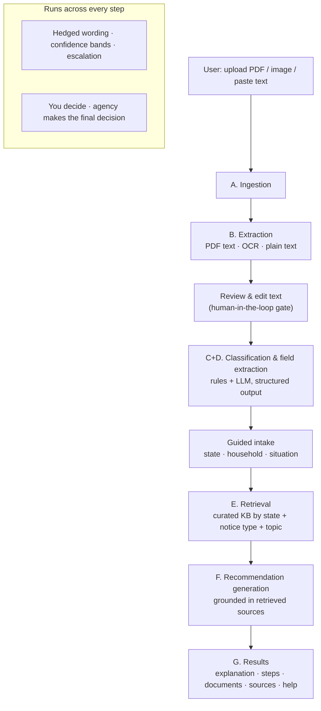

# SNAP Notice Navigator

**Understand your confusing SNAP letter in plain language — and get safe, source-backed next steps.**

SNAP Notice Navigator is an AI-powered **notice interpreter and next-step navigator** for people who receive
confusing SNAP (food assistance) letters — denials, requests for documents, recertification notices, closures,
and benefit changes. You upload or paste the notice, review the text, answer a few calm questions, and get a
plain-language explanation plus a prioritized, **officially-sourced** checklist of what you *could* do next.

It does **not** decide eligibility and does **not** give legal advice. The AI interprets and suggests; **you**
decide; your **state SNAP agency** makes the official decision.

> Built for the **USAII Global AI Hackathon** — Undergraduate track, Challenge Brief 4 ("Fix Systems People
> Depend On"), Direction A: Benefits Navigator.

---

## The problem

SNAP serves tens of millions of people, but the system communicates through dense, legalistic notices.
A typical letter might say *"Your household's countable monthly income exceeds the gross income limit per
MPP 63-409; 7 CFR 273.9"* — and then list a deadline to act. For someone who is stressed, time-constrained,
and not fluent in government language, the result is the same whether the notice is a denial, a routine
document request, or a renewal reminder: **confusion, and often a missed deadline that costs them benefits.**

Most benefits aren't lost because people don't qualify — they're lost because a notice wasn't understood or a
deadline was missed. This tool attacks that specific failure point.

## User story

> *"I got this scary SNAP letter. What does it actually mean, and what should I do next?"*

Maria receives a CalFresh **Notice of Action** that says her application was denied. She doesn't understand why,
or whether she can do anything about it. She opens SNAP Notice Navigator, pastes the letter (or snaps a photo),
**reviews the text the app read and confirms it's right**, answers a few questions (her state, household size,
whether she's appealing), and gets:

- a calm, plain-language explanation of what the notice likely means,
- the likely reason it happened,
- a prioritized checklist (*read the reason → consider a hearing within the deadline → gather pay stubs → maybe reapply*),
- the exact documents to gather,
- **links to the official CalFresh and USDA pages** each suggestion is based on,
- and how to reach a real person (211, legal aid, her county office) — with a clear reminder that her **agency makes the final call.**

---

## Core features

1. **Upload & parse** — PDF, image, or pasted text. OCR for photos/scans. PDF text extraction for digital notices.
2. **Review & correct (human-in-the-loop gate)** — you see exactly what the app read and confirm it before anything is analyzed.
3. **Plain-language explanation** — what the notice is, what it's asking, and any deadline, in everyday English.
4. **Classification + field extraction** — notice type + agency, dates, deadline, reason, requested documents, contact info.
5. **Guided intake** — a short, calming set of questions (state, household size, income band, situation, language).
6. **Source-grounded recommendations** — prioritized next steps, documents to gather, and **official source links** for every suggestion.
7. **Responsible-AI throughout** — hedged language, confidence labels, low-confidence fallback, and a persistent "your agency decides" disclaimer.

---

## Architecture

A clean A→G pipeline with separated concerns. The deterministic and AI layers are independent and each module
has a single public entry point.



| Module | Where | Responsibility |
|---|---|---|
| A. Ingestion | `src/app/upload` | Accept file/paste; route to extraction |
| B. Extraction | `src/lib/extraction/` | PDF text (`pdf-parse`), OCR (`tesseract.js`), plain text — behind one `Extractor` interface (OCR is swappable) |
| C+D. Classification & fields | `src/lib/analysis/` | `rules.ts` (keyword classifier + regex extractor) + `llm.ts` (Claude structured output); `index.ts` orchestrates with confidence handling |
| E. Retrieval | `src/data/knowledge/` | Curated KB (federal + CA/TX/MO); `retrieve()` scores by state + notice type + topic |
| F. Recommendation | `src/lib/recommend/` | Generates explanation/steps/documents grounded in retrieved sources; deterministic template fallback |
| G. Output | `src/app/results` | Structured, calm results UI with sources, help, and disclaimers |

**API routes:** `POST /api/extract` (B), `POST /api/analyze` (C+D), `POST /api/recommend` (C+D+E+F in one call).

## AI pipeline

Two cleanly separated LLM steps, both using **Claude** (`claude-sonnet-4-6`) via the Anthropic SDK with
**structured outputs** (Zod schemas + `messages.parse`) so responses are deterministic and schema-validated:

1. **Extraction & classification** — reads the (user-confirmed) notice text and returns a typed
   `NoticeUnderstanding`: notice type (one of 6), a 0–1 confidence, a one-sentence summary, brief grounded
   reasoning, and extracted fields (agency, dates, deadline, reason, requested documents, contact).
2. **Recommendation generation** — takes the understanding + intake answers + the **retrieved source snippets**,
   and produces a grounded explanation, likely-issue summary, prioritized steps, and documents to gather.

**Grounding & hybrid design:**
- A **deterministic rules + regex layer always runs** — it classifies by keywords and extracts fields by regex.
  This is the offline-safe fallback and also backfills any field the LLM leaves blank.
- **Sources are attached from the curated KB, never invented by the model.** The LLM writes prose; the citations
  are real. If the LLM and rules confidently disagree, confidence is lowered.
- If `ANTHROPIC_API_KEY` is absent or any LLM call fails, the app falls back to the rules + template path and
  **still produces a safe, source-backed result** — the demo never hard-fails.

## Responsible AI

The main risk is **incorrect interpretation or user over-reliance.** Mitigations are visible in both the UI and the code:

- **Hedged language only** — "may", "likely", "possible". Never "you definitely qualify", "this decision is wrong", or "you will receive benefits". Enforced in prompts *and* templates.
- **Confidence labels** — every result shows a confidence band; a calm meter and the model's reasoning are available in a transparency disclosure.
- **Low-confidence fallback** — when uncertain, the app says so plainly and routes the user to their local office or a free benefits advocate.
- **Source basis shown** — every recommendation lists the official USDA/state pages it's based on.
- **Separation of steps** — document extraction is separate from recommendation generation, with a mandatory user-review gate between them.
- **Limited, honest scope** — deep support for 3 states; unsupported states get clearly-labeled federal baseline guidance.
- **No data retention** — notice text lives only in the browser session (sessionStorage); files are processed in memory and never stored.

## Human-in-the-loop

The interface makes the roles explicit (shown on the landing page and the results page):

- **The tool** explains the notice and suggests possible steps.
- **You** decide what to do — review and correct the extracted text before analysis, and choose whether to appeal, reapply, submit documents, or contact the agency. Steps are framed as options, not commands.
- **Your SNAP agency** makes the official, final decision.

The review step requires an explicit *"I've read this and it matches my notice"* confirmation before any analysis runs.

---

## Tech stack

Next.js 16 (App Router) · React 19 · TypeScript · Tailwind CSS v4 · Anthropic SDK (`claude-sonnet-4-6`) ·
Zod · `tesseract.js` (OCR) · `pdf-parse` (PDF text).

## Setup

**Prerequisites:** Node.js ≥ 18.

```bash
npm install
cp .env.example .env.local   # optional — see below
npm run dev                  # http://localhost:3000
```

**Environment (`.env.local`) — optional:**

| Variable | Purpose |
|---|---|
| `ANTHROPIC_API_KEY` | Enables the AI extraction + recommendation steps. **Without it, the app runs on the deterministic rules + templates path** and still works end-to-end. |
| `LLM_MODEL` | Override the model (default `claude-sonnet-4-6`). |

```bash
npm run build      # production build
npm run lint       # lint
npx tsc --noEmit   # typecheck
```

> First image OCR downloads the Tesseract English data (~5 MB) from a CDN and caches it locally.

## Demo

The app ships with **three seeded sample notices** (synthetic, no real personal data) so you can demo the full
journey reliably — and the offline fallback means it works even with no API key and no internet. See
[docs/DEMO.md](docs/DEMO.md) for the demo script, the sample cases, and how to run "demo mode."

## Tool & model disclosure

- **AI model:** Anthropic Claude `claude-sonnet-4-6`, called server-side via the official Anthropic TypeScript SDK with structured outputs. Used for (1) notice classification + field extraction and (2) source-grounded recommendation generation.
- **OCR:** `tesseract.js` (on-device, open source). **PDF text:** `pdf-parse`.
- **Knowledge base:** hand-curated snippets + links to official USDA/FNS and state SNAP pages (`src/data/knowledge/`). Source links come from this KB, never from the model.
- **Data handling:** no accounts, no database. Notice text is held in the browser session only; uploaded files are processed in memory and discarded.

## Scope & limitations

- Deep, curated support for **California, Texas, and Missouri**; all other states receive labeled federal-baseline guidance.
- Scanned/photo **PDFs** (no embedded text) are reported as such and the user is asked to upload an image (which is OCR'd) or paste the text.
- Sample notices are **synthetic**; real notices vary widely in layout.
- This is a hackathon MVP, **not an official government service** and **not legal advice.**

## License / disclaimer

Not affiliated with the USDA or any state agency. Provided for informational purposes only; your state SNAP
agency makes all final decisions about your benefits.
